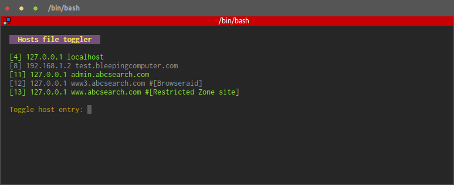
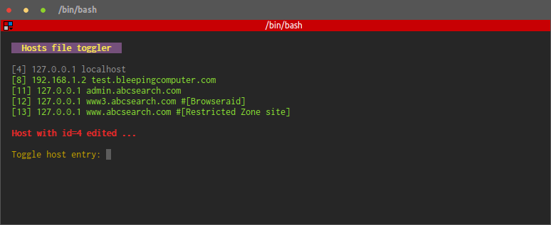

# CLI /etc/hosts easy toggler

### Contact & Features

You can contact me via:

  - Twitter @mitjafelicijan or #clihosts
  - Email <mitja.felicijan@gmail.com>
  - Github issues <https://github.com/mitjafelicijan/hosts/issues>

### Updates

 - (October 12, 2014) Added support for user input history. You can use up and down arrow
to access previously entered host row id's.

### Installation

If you have existing hosts defined please make sure that the ones commented have 
space between # and host otherwise script will not work properly. It is on a todo to
support this non-space comments.
	
	Not ok
	#127.0.0.1  admin.abcsearch.com

	Ok
	# 127.0.0.1  admin.abcsearch.com

Installation 
	
	cd /path-to-wherever-you-want-your-script/
	wget -O hosts.py https://raw.githubusercontent.com/mitjafelicijan/hosts/master/hosts.py && chmod +x hosts.py

### Usage

Because we are attempting to modify system files we need to execute script with root
privileges. So use it with sudo.

	sudo ./hosts.py --version

	sudo ./hosts.py --help

	sudo ./hosts.py path-to-your-hosts-file
	(by default /etc/hosts will be used)

Default view when you launch application. Gray rows are disabled hosts. Green rows
are enabled hosts. numbers in square brackets on the left side of row represents row
number in hosts file. You address record you want to toggle by inserting row number in 
the user input and pressing enter.

| User input  | Description                     |
| ----------- | ------------------------------- |
| 1 .. n      | Hosts row id you want to toggle |
| q or Q      | Quit application                |
| r or R      | Reload hosts list               |

**Youtube video preview**

Click on a thumbnail bellow.

### Warning

Please beware that this script updates /etc/hosts file so it is advised
to make backup of the file before using it.

### License

The MIT License (MIT)

Copyright (c) 2014 Mitja Felicijan <mitja.felicijan@gmail.com>

Permission is hereby granted, free of charge, to any person obtaining a copy
of this software and associated documentation files (the "Software"), to deal
in the Software without restriction, including without limitation the rights
to use, copy, modify, merge, publish, distribute, sublicense, and/or sell
copies of the Software, and to permit persons to whom the Software is
furnished to do so, subject to the following conditions:

The above copyright notice and this permission notice shall be included in
all copies or substantial portions of the Software.

THE SOFTWARE IS PROVIDED "AS IS", WITHOUT WARRANTY OF ANY KIND, EXPRESS OR
IMPLIED, INCLUDING BUT NOT LIMITED TO THE WARRANTIES OF MERCHANTABILITY,
FITNESS FOR A PARTICULAR PURPOSE AND NONINFRINGEMENT. IN NO EVENT SHALL THE
AUTHORS OR COPYRIGHT HOLDERS BE LIABLE FOR ANY CLAIM, DAMAGES OR OTHER
LIABILITY, WHETHER IN AN ACTION OF CONTRACT, TORT OR OTHERWISE, ARISING FROM,
OUT OF OR IN CONNECTION WITH THE SOFTWARE OR THE USE OR OTHER DEALINGS IN
THE SOFTWARE.